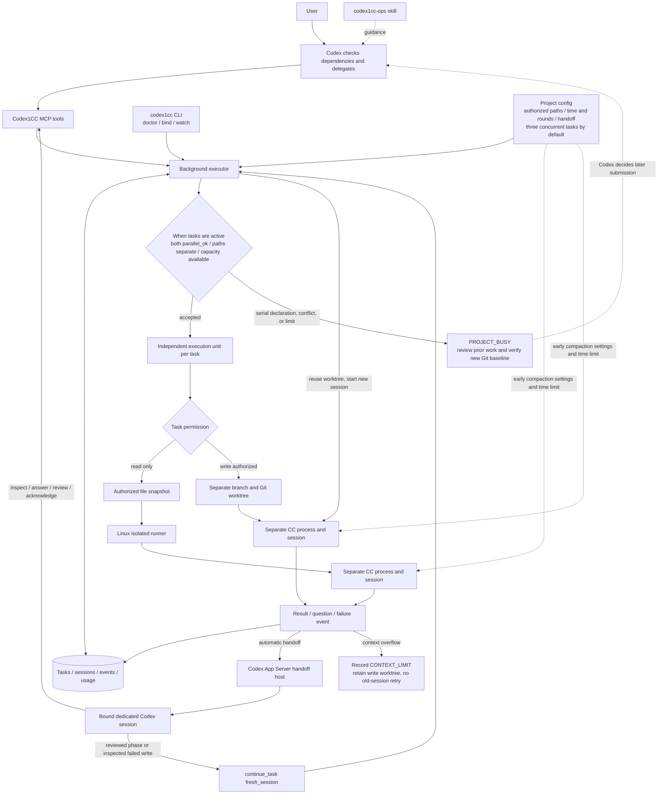

# Codex1CC

Codex1CC lets you ask Codex to hand a well-defined task to Claude Code and review the result. Tasks are read-only by default. An explicitly enabled native write backend lets Claude edit, test, and make local commits in a separate Git worktree. Task records persist on the computer running the tool.

Install Codex1CC where it can access your project files and Claude Code. Codex connects to it through MCP, a tool interface; you do not need to run a web service. Optional automatic handoff starts a bound Codex session when CC finishes, asks a question, or fails. Results are saved with the task; the original Codex window may not reopen.

**Status: alpha.** The Linux read-only runner and automatic handoff have each passed a small real task. The native write backend passed fake-CLI tests and a real two-round repair with automatic Codex scope replanning, a CC question answered by Codex, local commits, and final acceptance in a temporary project. See the [autonomous validation record](docs/autonomous-validation.md). Cross-machine acceptance remains open. Write mode runs commands in a trusted project and is not a filesystem or network sandbox.

**中文完整说明：**[安装、项目初始化、指挥 CC、跨会话验收与注意事项](README.zh-CN.md)。

Licensed under MIT; see [LICENSE](LICENSE).

Experimental automatic handoff is implemented on the supported Linux path. Simulated tests and real CC-to-Codex automatic review and question handoff passed. Active-host restart recovery and installation on other machines remain unverified. See the [validation record](docs/validation.md), [host compatibility](docs/handoff-compatibility.md), [write backend plan](docs/native-write-backend-plan.md), [long-running task plan](docs/long-running-tasks-plan.md), [parallel agent plan](docs/parallel-agents-plan.md), and [PRD v1.6](Codex1CC%20产品需求文档.md). Manual use remains available.

## How the pieces fit together



Codex decides which tasks are genuinely independent. The executor checks declared paths, `parallel_ok`, and the per-project limit. Up to three tasks may run by default, but tasks without an explicit parallel declaration remain serial. Each task keeps its own session, events, and usage; write tasks also have separate branches and worktrees. A conflict returns `PROJECT_BUSY`; Codex submits follow-up work only after reviewing the prior result and verifying its Git baseline. Manual mode supports on-demand checks, while automatic handoff wakes the bound Codex session for questions, deliveries, or failures. `watch` waits for program events without repeated model calls. A reviewed phase or inspected failed write task can continue in its worktree with a fresh CC session; context overflow retains the worktree without retrying the old session. Review does not merge or push commits.

## Requirements

- Python 3.10 or newer, a Codex client that supports local stdio MCP, and Claude Code CLI.
- Linux with bubblewrap for real read-only tasks. WSL uses the Linux path.
- macOS read-only isolation is planned in the [PRD](Codex1CC%20产品需求文档.md). Native write behavior on macOS has not been validated.
- Your own Claude Code authentication and model service. You are responsible for model charges.

## Install and configure

Install from a checkout using a Python tool environment:

    uv tool install .
    # or: pipx install .
    codex1cc install-skill
    codex1cc init-config
    codex1cc config-path

Edit the displayed JSON config. Keep it readable only by your user (mode 0600). Example:

    {
      "projects": {
        "demo": {
          "root": "/absolute/path/to/demo",
          "shared_context": "CODEX1CC_CONTEXT.md",
          "read_paths": ["README.md", "docs", "src"],
          "model": "your-working-model-id",
          "limits": {"seconds": 1800, "wall_seconds": 28800, "rounds": 3}
        }
      }
    }

Run `init-config` only once; it refuses to overwrite an existing configuration. Keep the JSON file private (`chmod 600 "$(codex1cc config-path)"`). The project ID must contain only ASCII letters, digits, `_`, or `-`, and `root` must be an existing absolute directory. `model` may be omitted if Claude Code's default model works; otherwise use a verified model ID. `limits.seconds` caps CC agent work, while `limits.wall_seconds` caps the whole round. A task can lower either cap, and the wall cap must be at least the agent cap. `rounds` remains the continuation cap. Legacy project `limits.usd` is ignored and new task `limits.usd` is rejected.

Create the shared context file inside the target project before submitting a task. Record authoritative document paths, stable constraints, and reusable public facts; exclude credentials and unverified status claims. Claude receives a fixed copy even if it is not in the requested `scope`. For read-only tasks, selected paths are copied into a private snapshot; symbolic links and special files are rejected. Each task path must exactly match a configured `read_paths` entry: if `docs` is allowed, request `docs`, not an unlisted `docs/file.md`. Exclude generated assets and caches; a read-only snapshot is limited to 20 MiB and 2000 files.

### Long-running tasks and context protection

For tasks it launches, Codex1CC asks Claude Code to compact earlier: by default, at 70% of an auto-compact window capped at 500000 tokens. Claude Code caps that window at the model's actual context size if smaller. Per-project settings may override this, for example `"context_policy": {"auto_compact_window": 500000, "auto_compact_percent": 70}`. The allowed window is 100000–1000000 tokens and the percentage is 1–90; actual behavior also depends on the CLI, model, and Claude settings. On Linux native-write tasks, `limits.seconds` counts time spent by CC itself. It pauses while a non-bridge descendant command such as a test, build, or gate is running. `limits.wall_seconds` continues counting and stops the whole round at its hard cap. Both default to the same value for backward compatibility and may be set up to 86400 seconds. Write long gate output to files and return a conclusion, exit code, and path.

After a write task delivers a reviewed phase, Codex can check the artifacts and known cumulative cost, then call `continue_task(..., fresh_session=true)` to start a new CC session in the same task worktree without loading the old conversation. The same relay is available after a failed write task only when Codex has explicitly inspected its retained diff, commits, scope, and test evidence; the continuation instruction must state what is verified and what remains. If CC still exceeds its context window, the task fails with `CONTEXT_LIMIT` and retains its write worktree. Automatic handoff asks Codex to inspect the evidence. The failed or overflowing session is never retried automatically. Automatic Codex review and fresh-session relay between CC rounds have passed a real two-round task; proactive checkpointing within a running CC round remains unimplemented and unvalidated. Claude Code background jobs started outside Codex1CC are not managed by this task mechanism. See the [long-running task plan](docs/long-running-tasks-plan.md).

### Optional native CC editing (experimental)

For a Git repository you trust, add `"write_backend": {"enabled": true, "write_paths": ["src", "tests", "docs"]}` to its project configuration. The root must be the repository top level. Use `["."]` to explicitly allow the full repository. Ask Codex to submit a development task with `actions=["read","write","execute"]`, a narrower `scope`, acceptance checks, and a time limit. Codex1CC creates a `codex1cc/<task_id>` branch and a separate worktree from the current `HEAD`; uncommitted changes in the original workspace are not included. CC may make local commits. No merge or push is performed by Codex1CC.

> Use $codex1cc-ops to delegate this complete development task in demo to CC with read, write, and test execution. Limit changed paths to `src` and `tests`, use automatic handoff, and review the actual diff, commits, and test evidence when CC finishes. Submit once; do not poll or retry automatically.

The result includes the worktree, base and final commits, dirty state, and paths changed outside the declared scope. CC's Bash access can reach local files and networks; `write_paths` and `scope` are admission and review rules, not a hard sandbox. Use this only with projects and environments you trust. Canceled and failed tasks preserve their worktree for review. After a CLI failure, Codex may explicitly accept valid work or continue an incomplete write task with a fresh CC session after checking the evidence; the original failed session is not resumed. Existing Claude background sessions are not adopted.

Run diagnostics:

    codex1cc doctor

The doctor command starts the background process if needed. It checks whether bubblewrap can launch; it does not prove that your model credentials or endpoint work. `install-skill` installs the user-level `$codex1cc-ops` workflow so Codex can bind, rebind, unbind, submit, and handle automatic tasks on request. Restart an already open Codex client if the skill does not appear. After upgrading Codex1CC, run `codex1cc install-skill --force` to update its managed skill files; without `--force`, locally modified files are preserved and the command fails clearly.

Register the MCP server explicitly in Codex after reviewing the command:

    codex mcp add codex1cc -- /absolute/path/to/codex1cc mcp

Find that absolute executable path with command -v codex1cc. Use the path in the registration so a Codex client launched with a different PATH can still start the server.

Codex should submit one cohesive task with objective, task-specific context, acceptance checks, deliverables, path scope, time limit, and a request ID. Codex does not set or negotiate CC cost limits. On the next natural interaction, call list_tasks, then get_task for the task needing an answer or review. Only complete_task after checking the actual result.

### Use the `$codex1cc-ops` skill

`codex1cc install-skill` installs the bundled [skill instructions](src/codex1cc/bundled_skills/codex1cc-ops/SKILL.md) in `~/.agents/skills/codex1cc-ops/` for the current user. The skill guides **Codex**; it is not a standalone shell command. After installing the skill and registering MCP, restart or refresh Codex and include `$codex1cc-ops` in a chat request. Codex then checks the project, calls the relevant tools, and reports the result. It changes task or binding state only when you request an operation.

Authorize the project in the configuration above first; the skill does not grant new project access. Replace `demo` below with your project ID. You may omit the ID when the current directory matches exactly one configured project; otherwise, name it explicitly.

| Goal | Prompt to give Codex |
|---|---|
| Check connectivity | `Use $codex1cc-ops to check demo's executor, MCP registration, and automatic handoff connection. Diagnose only; do not submit a task.` |
| Bind automatic handoff | `Use $codex1cc-ops to create a dedicated automatic handoff binding for demo and verify it is connected.` |
| Submit read-only work | `Use $codex1cc-ops to ask CC to check demo's README and docs against the code. Cite file evidence for incorrect claims. Read only; submit once and give me the task ID.` |
| Submit coding work | `Use $codex1cc-ops to ask CC to fix <specific issue> in demo. Change only src and tests, run <acceptance command>, and deliver the diff, test result, and local commit. Use automatic handoff.` |
| Check progress once | `Use $codex1cc-ops to summarize the latest activity and blockers for demo's current task. Check once; do not poll.` |
| Answer or review | `Use $codex1cc-ops to inspect demo's tasks waiting for an answer or review. Check the original request and evidence; ask me about decisions only I can make.` |
| Rebind | `Use $codex1cc-ops to update demo's automatic handoff binding. Check active tasks and unresolved events before rebinding.` |
| Unbind | `Use $codex1cc-ops to unbind demo and report how many pending events were disabled. Do not cancel CC tasks.` |

Coding tasks require `write_backend` to be explicitly enabled and the task scope to fit within `write_paths`; the skill never enables project write access merely because a prompt asks for edits. A new task worktree starts at the configured project's committed `HEAD`, so check its base before assigning work that depends on another branch. Automatic handoff requires a connected binding; manual tasks do not. If Codex cannot find the skill, confirm `codex1cc install-skill` succeeded and restart or refresh Codex. If the MCP tools are missing, check `codex mcp list`. After a Codex1CC upgrade, run `codex1cc install-skill --force` to refresh the bundled skill.

## Optional automatic handoff (experimental)

### Autonomous goals (0.6)

Automatic native-write submissions now default to `autonomous=true`. The executor
inherits a configured automatic project binding when `handoff` is omitted; pass
`handoff="manual"` to explicitly choose manual handling. It
stores the original objective, acceptance, and initial project write authorization
as a persistent goal. A failed CC round leaves that goal active. Codex must inspect
the retained artifacts, continue verified work, or record a concrete blocker with
`manage_goal`; acknowledging an active goal merely as `failed` or `reviewed` is
rejected. Pass `autonomous=false` for the previous single-event review behavior.
If the user restricts paths for the entire objective, pass `authorized_scope` at
submission to capture that narrower boundary separately from this round's `scope`.

For repairs, call `continue_task` with `fresh_session=true`, an exact instruction,
`review_note`, and the inspected commit as `expected_head`. An optional revised
`scope` is checked against both the original and current project write authorization.
The same worktree, partial commits, original objective, and acceptance survive the
relay. Existing outside-scope changes prevent replanning. No baseline merge is
needed. Completion requires `expected_head` and one `acceptance_evidence` entry per
original criterion. Evidence remains Codex's responsibility to verify.

Use `manage_goal(status="blocked", reason=...)` for actual technical impediments or
exhausted limits, and `status="needs_user"` for a genuine user decision. Use
`status="active"` to adopt an unfinished legacy automatic write task or resume a
recorded goal. Legacy adoption keeps initial path authorization and applies current
configured round/turn caps. An idle active goal receives a new recovery decision
event; uncertain prior turns are retained for reconciliation and produce an explicit
blocker. The executor never replays an uncertain event. Time, round, and handoff turn
caps remain enforced; configure `limits.rounds` and `handoff.max_turns` up to 10 for
longer workflows.

Controller conclusions, continuation, completion, and blockers are saved in a
durable inbox and delivered as local desktop notifications when supported. WSL
uses the Windows toast service. Delivery errors remain visible in the inbox.
`CODEX1CC_DESKTOP_NOTIFICATIONS=0` disables desktop delivery for a newly started
executor. The original Codex window is not guaranteed to reopen.

```sh
codex1cc status PROJECT_ID
codex1cc follow TASK_ID       # concise event stream across CC rounds; no model polling
codex1cc notifications       # saved notifications and desktop delivery errors
codex1cc upgrade [TASK_ID]   # drain workers, restart, refresh skill/MCP; optionally adopt retained work
```

`upgrade` waits for existing CC workers and accepted Codex turns to finish before
switching executors. The database migration makes a private backup first. A model
turn ending is not sufficient evidence that acceptance passed; controller reviews
must check real files, commits, and tests.

After installing `$codex1cc-ops`, ask Codex to execute lifecycle operations directly:

> Use $codex1cc-ops to create a dedicated automatic handoff binding for demo and verify the connection.

> Use $codex1cc-ops to rebind demo. Check for active tasks or unresolved handoffs first, then create the new binding only when it is clear.

> Use $codex1cc-ops to delegate this complete task to CC with automatic handoff. Submit it once, then handle completion, questions, or failure without polling.

> Use $codex1cc-ops to unbind demo and report how many pending events were disabled.

The skill executes the relevant commands and verifies their results. Creating a new dedicated binding uses one Codex model call; after the user explicitly requests that operation, the skill explains the cost impact and proceeds without asking again. The commands below remain available for manual operation.

On a Codex version with a managed App Server, start that service and bind a dedicated resumable session to your project:

    codex app-server daemon start
    codex1cc bind demo --create
    codex1cc doctor

`bind --create` makes **one real Codex model call** to initialize a persistent legacy session; charges are possible and the amount is not reported by this integration. To use an existing resumable legacy session without an initialization call, run `codex1cc bind demo EXISTING_THREAD_ID`. Empty sessions and unsupported history modes are rejected. `doctor` checks connectivity without invoking a model.

Ask Codex: “Delegate this complete task to CC with Codex1CC automatic handoff. Give me the task ID and connection status. On completion, question, or failure, review it and report a conclusion. Do not poll or resubmit the old task.” Codex should pass `handoff="automatic"` to `submit_task`; preflight failure returns `HANDOFF_UNAVAILABLE` before creating a task. The handoff thread handles events and stores its result with the task. Watch progress and the saved conclusion without a model call:

    codex1cc watch TASK_ID

`codex1cc unbind demo` disables future automatic handoffs; a Codex turn already in progress may finish. The managed service must remain available for prompt delivery. Sleep, offline time, or an unsupported host can delay handling. A task defaults to at most three automatic Codex turns of 600 seconds each; `handoff.max_turns` and `handoff.turn_seconds` can narrow or raise these within documented bounds. The host does not expose verified USD usage, so this mode cannot enforce a hard money cap. Codex review and continuation calls may incur model charges; idle monitoring does not. See [host compatibility](docs/handoff-compatibility.md) for tested limits.

If a handoff shows `needs_reconcile`, inspect its saved `turn_id`, reason, and Codex turn before taking action. Once the original turn and its actions are verified, Codex can call `ack_handoff` with the `event_id` and `receipt_token` from that turn's event message. An uncertain event is never automatically redelivered. If the turn cannot be reconciled, unbind the project and bind a new dedicated session for later tasks; keep the old event for manual investigation.

## Use Codex to direct Claude Code

Codex submits and reviews one complete task. CC reads a bounded snapshot for read-only work, or edits an isolated Git worktree when native write is enabled. Speak to Codex in natural language. Task state persists across Codex conversations. Manual mode requires a later check. Automatic mode starts the registered Codex handoff session on a task event without model polling; it may not reopen your original window.

### Start or re-enter an authorized project

Open the project workspace in your Codex client. In the CLI, start from the project directory:

```bash
cd /absolute/path/to/your-project
codex
```

Tell Codex which authorized project you want to manage, such as `demo` in the example above. Opening a directory alone does not select a Codex1CC project. If the MCP tools are missing, run `codex mcp list` and restart or refresh your Codex client. On another machine, authorize the project first; this repository does not ship your project configuration.

For a newly opened session in a project configured as `demo`, you can say:

> Continue with the demo project. Check the current branch and uncommitted changes, then see how the tasks I gave CC are progressing. Tell me if CC needs an answer or has a result ready for review. Do not submit the same task again or keep waiting for it to finish.

Codex checks task status for you; you do not need to remember tool names or status codes. The background process starts on demand, so there is nothing to launch for each session.

### Submit one bounded task

In plain language, tell Codex what you want to learn, which sources matter, what would count as a satisfactory answer, and what you want back. Mention any time or cost limit you have. Codex checks the authorized paths and fills in the tool arguments; you do not need to write JSON or memorize function names.

This prompt uses the `demo` configuration above. Replace the project name, sources, and objective for your project:

> Ask CC to compare the demo project's README and `docs` with the relevant `src` files. Identify claims that the code does not support or that still need verification. Give a file path for each finding and separate confirmed facts from questions. This is analysis only: do not edit files or claim to have run tests. Return a short conclusion and the first suggested follow-up task. Once delegated, give me the task number; we can review the result when I return.

Codex translates the request into a bounded task. CC can read only the selected snapshot and cannot execute project commands. A snapshot over 20 MiB or 2000 files is rejected; narrow the requested sources or authorize more specific paths. Keep tightly coupled steps together. Split work only when the parts are independent and can actually run in parallel. Each project allows up to three active tasks by default. Codex must explicitly set `parallel_ok=true` on every confirmed independent task; tasks without that declaration remain serial. Set `"parallel": {"max_agents": 1}` to restrict a project to serial execution, or choose a limit from 1 to 4. Each accepted task uses its own CC process, session, and write worktree. These are Codex1CC-managed workers, not Claude Code's built-in Agent tool. Overlapping scopes, serial tasks, and agent-limit overflow are refused while active. Submit conflicting work only after the prior result is reviewed and the new Git baseline contains its required changes; Codex1CC does not queue a task against a stale base. The parallel path has passed fake-CLI tests; real concurrent model runs remain unverified.

> Use `$codex1cc-ops`: give CC the independent demo tasks A and B in parallel, each with a separate, non-overlapping edit scope and acceptance checks. If they depend on each other or share a path, finish and review the first task, verify the second task's Git baseline, then submit it. Review delivery events without timed polling.

### See what CC is doing during a task

You can ask Codex for a one-time progress check before the task finishes:

> Check the CC task for the demo project. Summarize the recorded file reads, searches, findings, and blockers, and tell me when the last event occurred. If there is no new activity, say so. Check once; do not keep refreshing.

Codex reads the saved execution events and turns them into a short account of observable progress. Each call returns at most 50 events; for a longer task, Codex can page through them **during that one check** to reach the newest events. This is not a live view of CC's screen: the CLI may omit internal steps, and long events may be truncated. For a program-driven view, run `codex1cc watch TASK_ID`; it waits for events without calling a model. Ordinary progress does not wake Codex.

### Return later, answer, review, or cancel

You may close the Codex conversation. Reopen Codex in the project or resume the old conversation, then use the session-start prompt above. The executor stores task IDs, status, original objective, acceptance checks, scope, and results independently of the chat. If you know a task ID, ask:

> Check CC's earlier task, number "YOUR_TASK_ID". Tell me its progress, any question I need to answer, and its result. Do not submit it again.

| What you see | What to do |
|---|---|
| CC is waiting or working | Save the task number and ask Codex again later; do not keep checking. |
| CC has a question | Ask Codex to explain it, then give your answer for Codex to forward. |
| CC has returned a result | Ask Codex to review it against the original request; request more evidence if needed. |
| The task failed or stopped | Find out why, fix the cause, then explicitly ask for a new task. It is not retried automatically. |
| The task is complete or canceled | No action needed; its record remains queryable during the retention period. |

Review prompt:

> Help me review CC's result for the demo project. Check it against the original request and its evidence. If evidence is missing, tell me what is missing and ask CC to investigate further if possible. Record it as complete only when it meets the request, then give me the final conclusion. Do not treat CC's claim that a test passed as a verified test run.

If you no longer need a task, tell Codex to cancel it and give its task number. Recording acceptance does not edit or deploy the project. Follow-up investigation uses the original file snapshot; submit a new task to capture changed project files.

Read-only task content for completed, failed, and canceled tasks is pruned after 30 days when the executor next starts. Write task worktrees and review records stay until explicit user cleanup. Pending questions and reviewable tasks are retained. For Codex startup and MCP registration, see the official [Codex CLI](https://learn.chatgpt.com/docs/codex/cli) and [MCP](https://learn.chatgpt.com/docs/extend/mcp?surface=cli) documentation.

### Agent operating contract

1. Resolve the user's project name to an explicitly configured `project_id`; do not infer it from the current directory alone. On entering a session, call `list_tasks(project_id=..., statuses=["queued","running","continuing","waiting_answer","review_required","failed","interrupted"])` once as needed and fetch only actionable tasks.
2. Submit each cohesive objective once, with complete context, exact allowed `scope`, acceptance checks, deliverables, question policy, and bounded cost/time. Generate a unique `request_id` per operation; preserve it on retry.
3. When the user requests automatic handoff, set `handoff="automatic"` and report the returned connection state. Otherwise use manual mode. Return the task ID and end the turn; do not poll for CC.
4. When the user explicitly asks for progress, call `get_task(include_events=true)`. Start from the last cursor if known; otherwise start at 0 and use `has_more` and `next_cursor` to reach the newest events during this one check. Summarize only observed file activity and findings, not raw event streams or guessed completion. Never schedule repeated checks.
5. For an automatic event, call `get_task`, check the current state and original acceptance criteria, take an authorized action, then call `ack_handoff`. Manual mode handles the same states on a later interaction. Never auto-replay failed or interrupted work.
6. Put reusable public facts in the project shared file; return concise conclusions and evidence. Delegate independent work separately only when it can run in parallel. Editing and test execution require the explicitly enabled native write backend.

## Authentication and safety

Restricted Claude sessions inherit only selected Anthropic authentication, endpoint and model environment fields from the process environment or the user's Claude settings. Global MCP servers, plugins and broad tool grants are not inherited. Credentials are never passed in command-line arguments or returned by the MCP tools.

Linux read-only tasks use bubblewrap to expose only a private snapshot, Claude's own configuration and session data, the internal question tool, and its local socket. This runner does not expose command execution, WebFetch or browser tools. Native write tasks instead run with trusted-project command access in a Git worktree and do not use this isolation boundary.

Codex1CC does not set a CC USD limit. Reported cost is optional telemetry and may differ from the provider bill; missing cost data does not block continuation. Token savings come from cohesive tasks, shared facts, event handoff, independent sessions, early compaction, and concise results.

Completed, failed and canceled read-only task content is retained for 30 days, then pruned when the executor starts. Write task worktrees and review records require explicit cleanup. Tasks still waiting for an answer or review are not pruned. Claude's own session files are managed by Claude Code.

## Compatibility and release gates

| Environment | Automated tests | Read-only real task | Editing |
|---|---|---|---|
| Linux with bubblewrap | Passed locally | Passed locally with one read, one question, one resume | Disabled |
| WSL with bubblewrap | Same Linux code path | Passed locally on WSL; other WSL installations unverified | Disabled |
| macOS | Included in CI matrix | Fails closed until a verified isolation backend exists | Disabled |
| Native Windows | Not in v1 | Not supported | Not supported |

The local real test used a temporary project and a project-level model override. It made no changes to the user's global Claude settings or business repositories. macOS isolation and cross-machine compatibility remain required before a v1 release claim. CI runs fake-CLI tests and does not use model credentials.

See the [validation record](docs/validation.md) for the tested versions and remaining gates.

## Troubleshooting

- **SANDBOX_UNAVAILABLE:** Install bubblewrap on Linux and confirm unprivileged namespaces are permitted. On macOS, the isolation backend is not implemented yet.
- **PROJECT_NOT_ALLOWED:** Check that the project ID exists, every task scope entry exactly matches a configured project-relative `read_paths` entry, and the shared file exists. Symlinks and special files are rejected.
- **LIMIT_REACHED:** Narrow the scope, or check the configured agent time (`seconds`), hard wall time (`wall_seconds`), round, and snapshot limits.
- **HANDOFF_UNAVAILABLE:** Check the managed App Server, `codex1cc doctor`, and the bound resumable session.
- **CLI_FAILED:** Run codex1cc doctor, then check your Claude Code authentication, endpoint and model ID. A model rejected by its service is not a Codex1CC task success.
- **Task interrupted:** The executor restarted while a round was active. Review the snapshot and recorded events; it never replays an uncertain round automatically.
- **QUESTION_EXPIRED:** A blocking question remained unanswered for 24 hours. Inspect the saved task before deciding whether a session can be continued.
- **MCP server missing:** Verify the Codex registration with codex mcp list, then restart or refresh your Codex client. The stdio command is codex1cc mcp.

## Stop and uninstall

Use cancel_task for an active task. Stop the executor only after active tasks are resolved. Removing the Codex registration stops new MCP calls:

    codex1cc stop
    codex mcp remove codex1cc

After stopping active tasks, uninstall the Python package with the same tool used to install it. The configuration and state directories shown by doctor contain task history and are kept until you choose to remove them. Removing them is irreversible and does not modify any target project.

    uv tool uninstall codex1cc
    # or: pipx uninstall codex1cc

## Development and tests

    python3 -m pip install -e .
    python3 -m unittest discover -s tests -v

Use a current pip when building a wheel; older pip releases may ignore the project metadata. The automated tests use a fake Claude CLI and do not make model requests. See the [PRD](Codex1CC%20产品需求文档.md) for the full acceptance and release gates.
