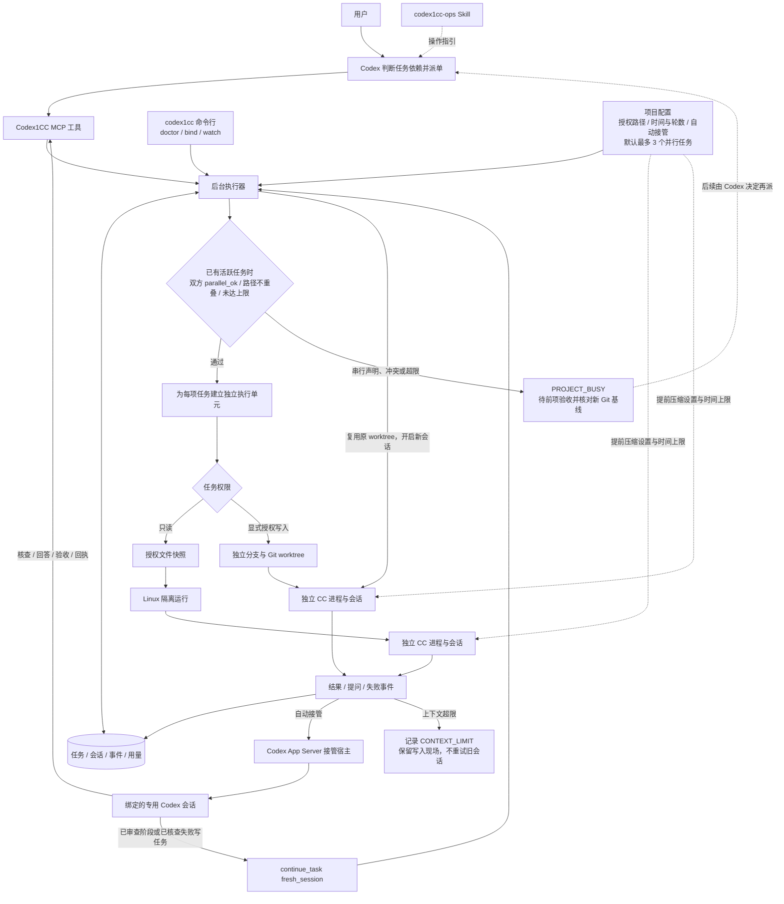

# Codex1CC 使用说明

[English README](README.md) · [产品需求文档](Codex1CC%20产品需求文档.md) · [验证记录](docs/validation.md)

Codex1CC 让你在 Codex 中把一项明确的工作交给 Claude Code（简称 CC），由 Codex 检查结果。默认任务只读取你授权的项目文件；显式启用写入后端后，CC 可在独立 Git worktree 中编码、测试和创建本地提交。即使关闭 Codex 对话，任务记录仍保存在运行工具的电脑上。

这个工具需要安装在能够访问项目文件和 Claude Code 的电脑上。安装后，Codex 通过 MCP（连接外部工具的接口）调用它；你无需自行运行网页服务。可选的自动接管模式会在 CC 完成、提问或异常时启动已绑定的 Codex 会话；运行记录也可用命令行查看。自动处理结果保存在任务记录中，不保证弹出原来的 Codex 窗口。

**当前是 alpha。** Linux 只读任务与自动接管各通过一次真实任务；写入后端通过模拟测试及临时项目的真实两轮修复，包括 Codex 自动调整范围、回答 CC 提问、本地提交和最终验收，详见[自动目标验证记录](docs/autonomous-validation.md)。跨机器验收仍待完成。写入模式允许 CC 执行命令，属于显式信任项目模式，不能当作本机文件或网络沙箱。macOS 只读隔离尚未实现；原生 Windows 未支持。完整门槛见 [验证记录](docs/validation.md)。

自动接管按 [PRD v1.6](Codex1CC%20产品需求文档.md) 实现了实验性 Linux 路径；模拟测试、真实 CC → Codex 自动验收及真实问题交接已通过。宿主运行中重启恢复及跨机器兼容性仍待验收，详见 [验证记录](docs/validation.md)与[兼容性记录](docs/handoff-compatibility.md)。手动模式仍可使用。

## 项目逻辑图



Codex 先判断任务之间是否真能独立完成；执行器再检查声明的路径、`parallel_ok` 和并发上限。默认最多 3 项并行，但任一任务未明确声明可并行时仍按串行准入。每项任务分别保存会话、事件与用量；写入任务还分别持有分支和 worktree。冲突任务返回 `PROJECT_BUSY`，前项验收并进入正确 Git 基线后再派，不会在旧基线上排队。手动模式按需查看，自动模式在提问、交付或失败时唤起已绑定的 Codex 会话；`watch` 等待程序事件，不反复调用模型。经审查的阶段或经核查的失败写任务可在原 worktree 用新会话接力；上下文超限会保留现场，不自动重试。验收本身不会合并或推送提交。

## 1. 安装前准备

- Python 3.10+；推荐使用较新的 `uv` 或 `pipx` 安装隔离的 Python 工具环境。
- 支持 stdio MCP 的 Codex 客户端，以及已能登录并调用模型的 Claude Code CLI。
- Linux/WSL 上安装 `bubblewrap`（命令名 `bwrap`），并允许非特权用户命名空间。
- 目标项目的文件位于运行工具的电脑上，且你知道希望允许 CC 读取哪些文件。模型调用会产生服务商费用。

## 2. 安装和注册（每台机器一次）

```bash
git clone https://github.com/UncleTIM-GZ/Codex1CC.git
cd Codex1CC
uv tool install .                 # 或 pipx install .
codex1cc install-skill            # 安装用户级 $codex1cc-ops Skill
codex1cc init-config             # 首次创建配置；已存在时不要重复运行
codex1cc config-path
codex1cc doctor
command -v codex1cc
```

把最后一条命令输出的**绝对路径**填入以下命令：

```bash
codex mcp add codex1cc -- /absolute/path/to/codex1cc mcp
codex mcp list
```

应看到 `codex1cc` 已启用。若 Codex 会话在注册或 Skill 安装之前已打开，重启或刷新客户端。`doctor` 会按需启动后台程序，只检查基础运行条件；它不验证模型账号、服务端模型 ID 或目标项目的任务结果。升级 Codex1CC 后可运行 `codex1cc install-skill --force` 更新其管理的 Skill 文件；若用户改过这些文件，不加 `--force` 时安装器会拒绝覆盖。Codex CLI 的项目目录、Skill 和 MCP 配置方式见 [官方 OpenAI 文档：Skills](https://learn.chatgpt.com/docs/build-skills)及 [MCP](https://learn.chatgpt.com/docs/extend/mcp?surface=cli)。

## 3. 初始化一个授权项目（每个项目一次）

用 `codex1cc config-path` 找到 JSON 文件，加入项目 ID、根目录、共享上下文、可读路径和时间、轮数上限。例如：

```json
{
  "projects": {
    "demo": {
      "root": "/absolute/path/to/demo",
      "shared_context": "CODEX1CC_CONTEXT.md",
      "read_paths": ["README.md", "docs", "src"],
      "model": "your-working-model-id",
      "limits": {"seconds": 1800, "wall_seconds": 28800, "rounds": 3}
    }
  }
}
```

- 项目 ID 只能由英文字母、数字、`_`、`-` 组成；`root` 必须是已存在的绝对目录。`model` 可省略，让 Claude Code 使用其默认模型；若默认模型在服务商端不可用，可填写已验证的模型 ID。
- `read_paths` 是**最大授权范围**，不是每次任务都要读的范围。每次 `scope` 只能从列表中选**完全相同的条目**。若授权 `docs`，任务可选 `docs`，不能直接改写成 `docs/one.md`；要单独选择文件，就把该文件另行加入授权列表。
- 在项目根目录创建共享上下文文件。可放权威资料入口、稳定约束、可复用的公共事实；不要放密钥、个人资料或未经核实的当前状态。CC 每次都会收到该文件的固定版本副本，即使它不在 `scope` 中；写入信任模式下不能把副本权限视为沙箱。
- 配置文件仅给当前用户读取，例如 `chmod 600 "$(codex1cc config-path)"`。项目文件会发往你给 Claude Code 配置的模型服务；只授权可以发送的路径。目录中若含符号链接或特殊文件，快照会拒绝；`.git` 不会被复制。
- `limits.seconds` 限制 CC 自身工作时间，`limits.wall_seconds` 限制整轮总时间，后者不得小于前者；任务可降低这两项，轮数上限来自项目配置。旧配置的 `limits.usd` 不再生效，新任务若传入该字段会被拒绝。单次快照最多 **20 MiB / 2000 个文件**；大型资产、构建产物和缓存目录应排除。

### 长程任务与上下文保护

从 0.6 起，原生写入任务选择自动接管时默认启用 `autonomous=true`，保存原始目标、全部验收项和首次项目授权。CC 一轮失败后目标继续有效，Codex 必须核查产物后续派，或用 `manage_goal` 记录具体阻塞；仅反馈“下一步需修复”不能结束活动目标。`autonomous=false` 保留单次事件审查模式。

如果用户对整个目标明确限制了改动路径，提交时用 `authorized_scope` 固化这一更窄的边界；`scope` 则描述当前 CC 轮次的范围。升级时可运行 `codex1cc upgrade TASK_ID`，服务切换后自动接管该任务尚未完成的保留成果。

续派时提供 `fresh_session=true`、明确指令、`review_note` 和已核查的 `expected_head`。可用 `scope` 调整修复路径；执行器同时检查首次与当前项目授权，保留原工作树和提交，原始验收项不变，无需先合并主分支。已有越出任务范围的改动会阻止重新规划。完成时必须提供已核查的 `expected_head`，以及与原始验收项一一对应的 `acceptance_evidence`。

实际技术阻塞或轮数用尽用 `manage_goal(status="blocked", reason=...)`，真正需要用户取舍才用 `needs_user`；`active` 可接管未完成的旧自动写任务或恢复目标。接管旧任务时保留首次路径授权，并采用当前配置的轮数与接管回合上限。活动目标无工作进程且无待处理事件时，执行器创建新的恢复决策事件；先前回合效果不确定时明确记录阻塞并通知，不重放旧事件。`limits.rounds` 和 `handoff.max_turns` 最高均为 10。

运行 `codex1cc follow TASK_ID` 可持续查看简洁事件并跨轮跟随，`codex1cc status PROJECT_ID` 查看任务和目标，`codex1cc notifications` 查看持久通知及投递错误。审查结论、续派、完成和阻塞会主动尝试桌面通知，WSL 使用 Windows 通知服务；不保证原 Codex 窗口自动打开。安装新版后运行 `codex1cc upgrade`，程序会等待已有 CC 进程和 Codex 接管回合结束，再切换执行器并刷新技能和 MCP 工具；数据库迁移前创建备份。

Codex1CC 为自己启动的 CC 任务默认设置更早的自动压缩：将自动压缩窗口设为最多 500000 token，达到该窗口的 70% 时交由 Claude Code 压缩；模型实际窗口更小时，以较小值计算。可逐项目调整，例如 `"context_policy": {"auto_compact_window": 500000, "auto_compact_percent": 70}`。窗口可设 100000–1000000，百分比可设 1–90；实际效果还取决于所用 CLI、模型和 Claude 设置。在 Linux 原生写入任务中，`limits.seconds` 只累计 CC 自身阅读、思考和编码时间；检测到测试、构建或门禁等非桥接子进程运行时暂停。`limits.wall_seconds` 始终累计，并在总硬上限终止整轮。为保持旧配置兼容，两者默认相同，最高均为 86400 秒。长日志请写文件并只返回结论、退出码与路径。

一个写入任务正常交付阶段结果后，Codex 可核对产物，再调用 `continue_task(..., fresh_session=true)` 在同一任务工作树开启全新 CC 会话；该模式不载入旧会话历史。失败的写任务也可这样接续，但 Codex 必须先明确核查保留的差异、提交、范围和测试证据，并在接续指令里写清已验证内容与剩余工作。若 CC 仍报上下文超限，任务会标为 `CONTEXT_LIMIT` 并保留写入工作树，自动接管会通知 Codex 核查。**不会自动重试失败或已溢出的旧会话**；CC 轮次之间的 Codex 自动审查与新会话接力已通过真实两轮任务；运行中的 CC 轮次内主动检查点仍待实现和验收。直接在 Claude Code 中启动的后台作业不受 Codex1CC 任务机制管理。设计和剩余工作见[长程任务计划](docs/long-running-tasks-plan.md)。

### 可选：授权 CC 编码与测试（实验性）

仅对你信任的 Git 项目，在该项目配置中增加：

```json
"write_backend": {"enabled": true, "write_paths": ["src", "tests", "docs"]}
```

`root` 必须是 Git 仓库顶层。`write_paths` 是准入上限；需要整个仓库时显式写 `["."]`。运行 `codex1cc doctor` 检查该项目的 `native_write.projects.demo.ready`。任务使用 `actions=["read","write","execute"]`，其 `scope` 填本次声明的改动路径。Codex1CC 从当前 `HEAD` 新建 `codex1cc/<任务ID>` 分支和独立 worktree，源工作区未提交改动不会随任务带入。CC 可以在任务分支本地提交；任务不会自动合并或推送。

例如对 Codex 说：

> 使用 $codex1cc-ops，把这项完整开发任务交给 demo 的 CC，允许读、写、执行测试，改动范围限 `src` 和 `tests`，使用自动接管。一次派清目标与验收条件；完成后检查实际 diff、提交与测试证据。不要轮询，也不要因 CC 费用提问或自动重交。

结果会列出任务 worktree、基线与最终提交、未提交改动及超出声明范围的文件。CC 的 Bash 能访问本机文件和网络；`write_paths` 与 `scope` 不能提供硬隔离。不要在不信任的仓库或含敏感凭据的环境中启用。取消或失败会保留任务 worktree，供人工核对；若 CLI 失败但产物有效，Codex 核对证据后可显式验收，并保留原失败原因。仅写入由 Codex1CC 新建的任务；既有原生 CC 后台会话暂不接管。实现步骤见[写入后端计划](docs/native-write-backend-plan.md)。

共享文件可以从下面的简短模板开始：

```markdown
# Shared project context
- Source of truth: README.md and docs/architecture.md; verify status against current code.
- Important constraint: do not change published interfaces without explicit review.
- Return concise conclusions with evidence paths; record reusable public facts here.
```

下面的操作示例使用 `demo` 项目；克隆 Codex1CC 仓库**不会自动授权任何项目**。首次配置后，可用 `codex1cc doctor` 检查运行条件；首次真实任务还需检查模型认证是否有效。

### 用 `$codex1cc-ops` Skill 操作

`codex1cc install-skill` 将随项目发布的 [Skill 指令](src/codex1cc/bundled_skills/codex1cc-ops/SKILL.md)安装到当前用户的 `~/.agents/skills/codex1cc-ops/`。它是给 **Codex** 的操作指引，不是独立运行的 shell 命令。安装 Skill 和注册 MCP 后，重新打开 Codex，在对话中写出 `$codex1cc-ops` 和你的要求。Skill 会让 Codex 实际检查项目、调用工具，并汇报结果；你无需手填 MCP 参数。只有明确要求操作时才会改变任务或绑定状态。

先按本节上方的配置示例授权项目；Skill 不会替你授予新项目的读写权限。下面把 `demo` 换成你的项目 ID。若当前目录恰好只匹配一个已授权项目，也可省略 ID；多个项目或无法匹配时，请写明 ID。

| 目的 | 可直接发给 Codex 的话 |
|---|---|
| 检查连接 | `使用 $codex1cc-ops 检查 demo 的运行条件、MCP 和自动接管连接；只诊断，不派任务。` |
| 绑定自动接管 | `使用 $codex1cc-ops 为 demo 创建专用自动接管绑定，并确认连接成功。` |
| 派只读任务 | `使用 $codex1cc-ops 把 demo 的 README 和 docs 交给 CC 核对：列出与代码不符的说明，附文件证据；只读，一次提交，交回任务 ID。` |
| 派编码任务 | `使用 $codex1cc-ops 让 CC 修复 demo 的具体问题：〈目标〉；只改 src 和 tests，运行〈验收命令〉，交付 diff、测试结果和本地提交；使用自动接管。` |
| 看一次进度 | `使用 $codex1cc-ops 查看 demo 当前任务最近的活动和卡点；只查一次，不轮询。` |
| 回答或验收 | `使用 $codex1cc-ops 查看 demo 待回答或待验收的任务，核对原要求与证据；需要我决定的事项先告诉我。` |
| 更新绑定 | `使用 $codex1cc-ops 更新 demo 的自动接管绑定；先核对活跃任务和未处理事件，再重绑。` |
| 解绑 | `使用 $codex1cc-ops 解绑 demo，报告停用了多少待处理事件；不要取消 CC 任务。` |

编码任务要求项目已显式启用 `write_backend`，任务范围必须落在 `write_paths` 内；Skill 不会因为一句“让 CC 改代码”而自行开启项目写入权限。新任务从项目根目录当前已提交的 `HEAD` 建 worktree，依赖其他分支上的工作时，先让 Codex 核对基线。自动接管还要求项目绑定成功；手动任务无需绑定。若 Codex 看不到 Skill，先确认 `codex1cc install-skill` 已成功，再重启或刷新 Codex；若看不到工具，检查 `codex mcp list`。升级工具后用 `codex1cc install-skill --force` 更新随包发布的 Skill。

### 开启自动接管（实验性）

安装 `$codex1cc-ops` 后，可以直接让 Codex 执行生命周期操作，例如：

> 使用 $codex1cc-ops 为 demo 创建专用自动接管绑定，完成后检查连接状态。

> 使用 $codex1cc-ops 更新 demo 的自动接管绑定；先检查是否有活跃任务或未处理接管事件，没有阻塞时再创建新绑定。

> 使用 $codex1cc-ops 把这项完整任务交给 demo 的 CC 并开启自动接管；只提交一次，完成、提问或失败时自动处理，不要轮询。

> 使用 $codex1cc-ops 解绑 demo，并报告停用了多少待处理事件。

Skill 会执行相应命令并验证结果。绑定或重绑到新专用会话会产生一次 Codex 模型调用；用户明确要求该操作后，Skill 会先说明费用影响再继续，不重复请求确认。也可以使用下面的命令手动操作。

先安装支持 managed App Server 的 Codex 版本并确认其服务运行。以下命令在支持的版本中可用：

```bash
codex app-server daemon start
codex1cc bind demo --create
codex1cc doctor
```

`bind --create` 为该项目建立一个专用 Codex 会话，并用**一次实际模型调用**完成初始化；会产生费用，金额以服务商记录为准。已有可恢复的 legacy Codex 会话也可用 `codex1cc bind demo EXISTING_THREAD_ID` 绑定，这一步不调用模型。普通空会话和不支持恢复的会话会被拒绝。`doctor` 会显示连接情况，但不发起模型调用。

派任务时告诉 Codex：

> 请把这个完整任务交给 CC，使用 Codex1CC 自动接管模式；一次派清目标、范围和验收标准。提交后告诉我任务编号和接管是否已连接。CC 交付、提问或异常时自动接手，核对结果并给出结论；不要定时查询，也不要自动重交旧任务。

Codex 应调用 `submit_task(..., handoff="automatic")`。如果接管预检失败，任务不会创建；`HANDOFF_UNAVAILABLE` 会说明原因。自动验收在专用 Codex 会话运行，结论会保存在任务的 `handoff` 记录中。可在原对话询问任务结果，或直接运行：

```bash
codex1cc watch TASK_ID
```

`watch` 等待程序事件并打印进度与最终记录，**不会为了监控反复调用模型**。关闭 `watch` 不影响后台任务。若要停止该项目后续自动接管，运行 `codex1cc unbind demo`；已经启动的 Codex 回合可能继续至结束。手动任务不需要绑定。宿主服务停止、电脑休眠或不支持的版本可能延迟接管；查看 `codex1cc doctor` 与任务的 `handoff` 状态。每项任务默认最多自动启动 3 次 Codex 回合，每回合默认最多 600 秒；项目配置中的 `handoff.max_turns` 和 `handoff.turn_seconds` 可在允许范围内调整。Codex 接管本身会消耗模型费用，当前宿主不提供可核实的 USD 用量，因此不能设置硬金额上限；等待期间不会产生监控模型调用。

如果 `handoff` 显示 `needs_reconcile`，先查看任务记录中的 `turn_id`、原因和该 Codex 会话已保存的处理结果。确认原回合已结束且处理动作可核实后，可让 Codex 用原事件消息中的 `event_id` 和 `receipt_token` 调用 `ack_handoff` 显式结案；系统不会自动重投不确定的旧事件。如果原回合无法核对，可先 `unbind` 停用自动接管，再为后续任务绑定新的专用会话，并保留旧事件供人工排查。

## 4. 每次进入项目怎么开始

在项目目录中启动 Codex；桌面或 IDE 客户端则打开该项目工作区。告诉 Codex 你要管理哪个已授权项目，例如上文配置的 `demo`。打开目录本身不会自动选定 Codex1CC 项目。

```bash
cd /absolute/path/to/demo
codex
```

如果已授权 `demo`，新会话可以直接说：

> 继续 demo 项目。先看看当前分支和未提交的改动，再查看之前交给 CC 的任务进展。如果有问题需要我回答，或者有结果可以验收，请告诉我；不要重复派任务，也不用一直等它完成。

Codex 会自行查询任务状态；你不需要记住工具名称或状态代码。任务记录不依赖 Codex 聊天记录，新会话仍能查到原目标、验收标准和结果。只读任务的已完成、失败或取消内容在 30 天后、后台程序再次启动时清理；写入任务的 worktree 和审查记录保留，直到用户明确清理。

## 5. 怎样给 CC 派任务

用自然语言说清楚**想解决什么、要看哪些资料、怎样才算完成、希望得到什么结论**。有时间要求，也一并告诉 Codex。Codex 负责核对授权范围并填写工具参数；你不需要写 JSON 或记住函数名，也不需要为 CC 费用限额作裁定。

以下指令基于上文的 `demo` 配置；使用时换成你的项目名和资料范围：

> 请让 CC 对照 demo 项目的 README、`docs` 和相关 `src` 文件，找出文档中没有代码依据或仍需核实的说法。每项附上依据和文件路径，区分已确认事实与待核实问题。只做分析，不改文件，也不要声称跑过测试。交付简短结论和建议的第一项工作；派发后告诉我任务编号，下次我回来再验收。

把几个相互依赖的小步骤写进同一个任务。只有互不依赖、能真正并行的工作才考虑分别交付。每项目默认最多同时运行 3 个任务；Codex 必须对已确认独立的每项任务明确传 `parallel_ok=true`，未声明的任务仍按串行准入。可在项目中设置 `"parallel": {"max_agents": 1}` 限制为串行，或在 1–4 范围内调整上限。每项由独立 CC 进程、会话及写入工作树执行。这种隔离单元由 Codex1CC 管理，并非 Claude Code 内置的 Agent 工具。执行器拒绝与活跃任务路径重叠、未声明独立或超出数量上限的任务。冲突工作应等前项审查并进入正确 Git 基线后再派，工具不会自行把旧基线的任务排队重试。当前并行能力通过模拟测试，真实并发验收仍待完成；详见[并行 Agent 计划](docs/parallel-agents-plan.md)。任务完成后，CC 只返回结论、证据和阻塞项，Codex 负责核查。

> 使用 `$codex1cc-ops`：把 demo 中互不依赖、修改路径不重叠的 A 和 B 分别交给 CC 并行完成。每项写明范围与验收标准。若发现依赖或路径冲突，先完成并审查前项，核对新任务的 Git 基线后再派后项。交付事件触发时验收，不要定时轮询。

### 运行中想看 CC 在做什么

你可以随时主动问 Codex，不必等任务完成。例如：

> 看一下 demo 项目交给 CC 的任务现在进展如何。概括已经记录的文件读取、搜索、发现和卡点，告诉我最后一条记录的时间；如果没有新活动就直说。只查这一次，不要持续刷新。

Codex 会读取这项任务已保存的运行事件，并把原始记录整理成人能看懂的进展。每次最多取 50 条事件；记录较多时，Codex 可以在**这一次查询中**翻页读完，再概括最近的活动。这不是 CC 屏幕的实时转播：CLI 不一定报告每个内部步骤，记录也可能被截短。不想使用模型概括进度时，可以运行 `codex1cc watch TASK_ID` 等待事件并查看原始记录；它不调用模型。普通进度不会自动唤起 Codex。

## 6. 稍后回来：回答、验收、继续或取消

手动模式下，可以关闭 Codex 对话；下次从项目目录打开新对话，先按第 4 节查询。自动模式的处理结论也会保存在任务记录中。若手上只有任务编号，可说：

> 帮我看看 CC 上次的任务，编号是“这里填任务编号”。告诉我进展、需要回答的问题和结果；不要重新派发。

| 看到的情况 | 你可以怎么做 |
|---|---|
| CC 还在等待或工作 | 记下任务编号，以后再问 Codex；无需持续查看。 |
| CC 提了一个问题 | 让 Codex 说明问题，你回答后由 Codex 转给 CC。 |
| CC 已交结果 | 让 Codex 对照原要求验收；证据不足时可要求补查。 |
| 任务失败或中断 | 先了解原因，修复后再明确交付新任务；系统不会自行重试。 |
| 已完成或已取消 | 无需处理；记录在保留期内仍可查询。 |

验收指令示例：

> 帮我验收 demo 项目上次交给 CC 的任务。对照原要求检查结论和证据；证据不足就告诉我缺什么，条件允许时再让 CC 补查。合格后登记完成，并告诉我最终结论。不要把 CC 自称“测试通过”当成真的跑过测试。

不再需要的任务，可以告诉 Codex 取消并给出任务编号。验收登记不会改动或发布项目。补查使用**原来的文件快照**；项目文件变化后，需要新交一项任务才能看到新内容。

## 7. 给 Codex 的执行约定（AI 可直接读取）

1. 先确认用户说的项目对应已配置的 `project_id`；不要只凭当前目录猜测 ID。进入新会话时按需调用一次 `list_tasks(project_id=..., statuses=["queued","running","continuing","waiting_answer","review_required","failed","interrupted"])`，只对待处理项调用 `get_task`。
2. 对一项完整、边界清楚的目标只调用一次 `submit_task`。把目标、背景、验收标准、交付物、配置中允许的 `scope`、时间上限和提问规则一次传清；`request_id` 唯一且重试复用。
3. 用户要求自动接管时传 `handoff="automatic"`，报告提交返回的接管状态；默认手动模式保持原用法。提交后给用户任务 ID，即结束本轮。不按定时器调用 `list_tasks`/`get_task`。
4. 用户明确要看运行进展时，调用 `get_task(include_events=true)`。已知上次游标就从该游标读取；否则从 0 开始，按 `has_more` 和 `next_cursor` 在同一次查询中翻到最新记录。概括有证据的文件操作和发现，不把原始事件流或推测当成已完成工作；不要设置定时查询。
5. 自动接管事件送达时，先用 `get_task` 核对原要求、当前状态和证据，再回答、验收、续接或请求用户决定；处理后调用 `ack_handoff` 记录结果。手动模式在下次自然交互中做同样检查。`failed`/`interrupted` 不自动重试。
6. 只把可复用的公共事实写入项目共享文件；任务输出只交简短结论和证据。只在可独立并行的情况下拆任务。编辑和测试须显式启用原生写入后端。

## 8. 限制、费用和隐私

Linux 只读任务使用 bubblewrap 隔离快照，只开放读取、搜索和内部提问；缺少隔离环境时该模式失败。原生写入任务在 Git worktree 中运行，CC 可编辑和执行命令，**不继承只读模式的文件隔离保证**。此 alpha 尚未完成跨机器和 macOS 验证。

任务仍受时间、轮数、授权范围和验收条件约束。Codex1CC 不设置 CC 的 USD 调用上限，也不因缺少费用报告停止接力；CLI 若提供费用数据，仅作为可选用量记录，不能视为最终账单。节省 token 依靠完整派单、共享公共信息、按事件接管、独立会话、提前压缩与简短交付。CC 使用你自己的 Claude Code 认证与模型服务。任务数据、事件和快照保存在运行工具的电脑上，可通过 `codex1cc doctor` 查看路径。

## 9. 常见问题

| 表现 | 检查方式 |
|---|---|
| 找不到 MCP 工具 | `codex mcp list`；检查注册命令的绝对路径，重启或刷新 Codex。 |
| `PROJECT_NOT_ALLOWED` | 核对项目 ID、共享文件和 `scope` 是否逐项等于 `read_paths` 中的条目；检查路径中的符号链接、特殊文件。 |
| `LIMIT_REACHED` | 缩小文件范围，或在项目授权上限内降低任务规模；检查时间、轮数及快照大小。 |
| `SANDBOX_UNAVAILABLE` | Linux 上检查 `bwrap` 和用户命名空间；macOS 的真实任务暂未开放。 |
| `HANDOFF_UNAVAILABLE` | 检查 `codex app-server daemon start`、`codex1cc doctor` 及绑定的会话；普通空会话和不支持恢复的历史记录不能用于自动接管。 |
| `CLI_FAILED` | 运行 `codex1cc doctor`，再检查 Claude Code 的认证、服务端地址及模型 ID。`doctor` 不会替你验证模型调用。 |
| 任务中断或问题过期 | 用 `get_task` 读状态和事件；问题等待超过 24 小时会过期。决定是否重新提交任务。 |

## 10. 停止、卸载与开发验证

先用 `cancel_task` 处理活跃任务，再运行：

```bash
codex1cc stop
codex mcp remove codex1cc
uv tool uninstall codex1cc     # 若用 pipx 安装，则用 pipx uninstall codex1cc
```

卸载工具不会自动删除项目共享文件、项目配置或已保存的任务历史。删除这些文件是独立且不可逆的操作。

从源码开发或验证：

```bash
python3 -m pip install -e .
python3 -m unittest discover -s tests -v
```

自动化测试使用假的 Claude CLI，不会产生模型调用；真实任务与各平台的验证范围见 [验证记录](docs/validation.md)。
